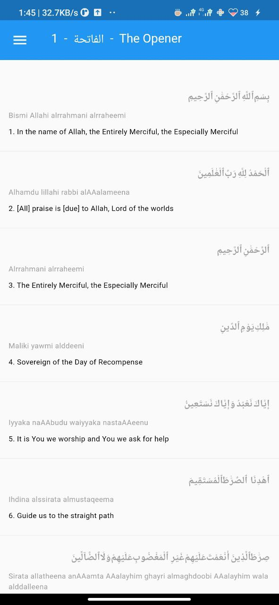

# Din

This is a simple material UI Quran and Sunnah reader.

🤟 Works on Android, iOS, Linux, Windows and Mac. Thank you Flutter 💖!

## Running the project

After cloning the project, change to this working directory and run :

```sh
flutter run
```

## TODO

- [ ] Find a designer
- [x] Publish on PlayStore
- [ ] Publish on Flathub
- [ ] Publish on F-Droid

## Features

- [x] Quran
- [x] Hadith and Sunnah
- [ ] Madrasa
- [ ] Multiple translations
- [ ] Learning resources
- [x] Favourites
- [ ] Application reviews and Release notes
- [ ] User manual

- [x] Text sharing
- [ ] Search quran
- [ ] Search every other list
- [ ] Islamic calendar
- [ ] Optional reminders (Prayer and Fasting)

## Customisation

- [x] Arabic / English / Transliteration toggles
- [x] Scroll Direction
- [x] App colors and theme
- [ ] Arabic and English fonts

## UI

| light                    | dark                          |
| ------------------------ | ----------------------------- |
|  |  |

## Building

For minimal app bundle size :

```sh
 flutter build appbundle --target-platform android-arm,android-arm64 --build-number <n>
```

For minimal apk size :

```sh
flutter build apk --split-per-abi
```
